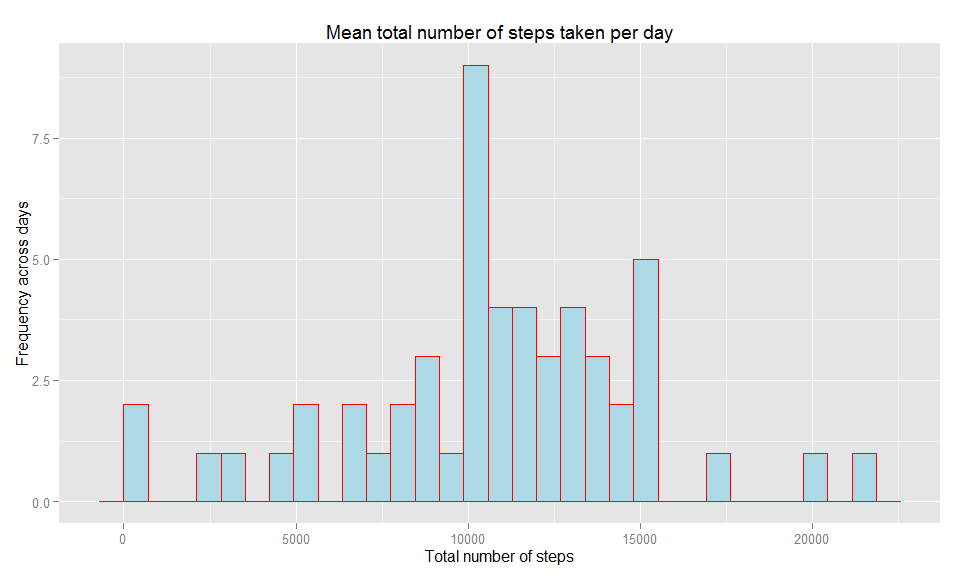
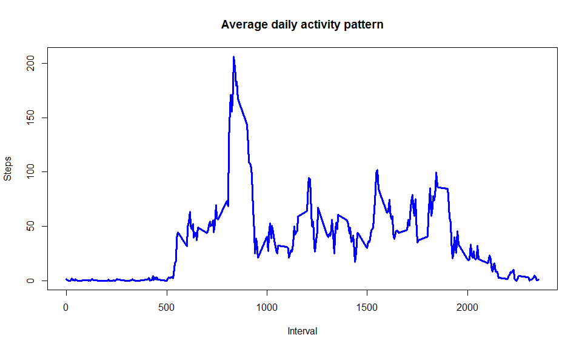
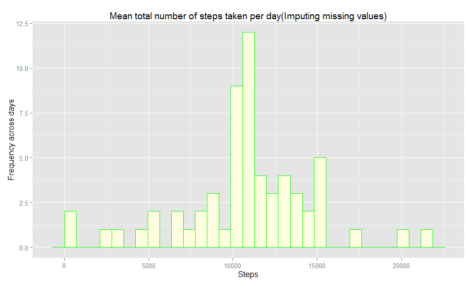
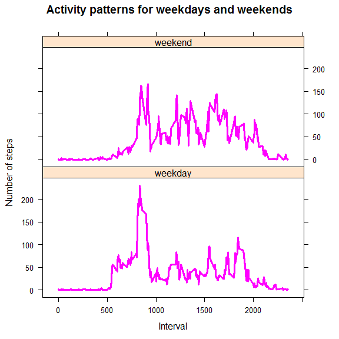

# Reproducible Research: Peer Assessment 1

## Loading dependant libraries and setting global options

```r
library(knitr)
```

```
## Warning: package 'knitr' was built under R version 3.2.2
```

```r
opts_chunk$set(echo = TRUE)
library(dplyr)
```

```
## Warning: package 'dplyr' was built under R version 3.2.2
```

```
## 
## Attaching package: 'dplyr'
## 
## The following objects are masked from 'package:stats':
## 
##     filter, lag
## 
## The following objects are masked from 'package:base':
## 
##     intersect, setdiff, setequal, union
```

```r
library(ggplot2)
```

```
## Warning: package 'ggplot2' was built under R version 3.2.2
```

```r
library(lattice)
```

```
## Warning: package 'lattice' was built under R version 3.2.2
```


## Loading and preprocessing the data

### Set the environment  

```r
current <- getwd()
setwd(current)
```
Geting the data from Source

```r
filename <- "repdata-data-activity.zip"

if (!file.exists(filename)){
        fileURL <- "https://d396qusza40orc.cloudfront.net/repdata%2Fdata%2Factivity.zip"
        download.file(fileURL, filename, method="libcurl")
}  
if (!file.exists("activity.csv")) { 
        unzip(filename) 
}
```
Reading input file as suggested 

```r
if(!exists("Inputdata")){
        Inputdata <- read.csv("activity.csv", header = TRUE, sep = ",", colClasses=c("numeric", "character", "numeric"))
}
```


## What is mean total number of steps taken per day?
**1. Calculating the total number of steps taken per day**

```r
if(!exists("Inputdata")){
        Inputdata <- read.csv("activity.csv", header = TRUE, sep = ",", colClasses=c("numeric", "character", "numeric"))
}

SumStepsDay <- aggregate(steps ~ date, Inputdata, sum)

ResultSet1 <- head(SumStepsDay)
print(ResultSet1)  
```

```
##         date steps
## 1 2012-10-02   126
## 2 2012-10-03 11352
## 3 2012-10-04 12116
## 4 2012-10-05 13294
## 5 2012-10-06 15420
## 6 2012-10-07 11015
```
**2. A histogram of the total number of steps taken each day**

```
## stat_bin: binwidth defaulted to range/30. Use 'binwidth = x' to adjust this.
```

 
**3. Calculating and reporting the mean and median of the total number of steps taken per day**  
Mean

```r
Mean <- mean(SumStepsDay$steps)
```

```
## [1] 10766.19
```
Median

```r
Median <- median(SumStepsDay$steps)
```

```
## [1] 10765
```

## What is the average daily activity pattern?
**1. Making a time series plot (i.e. type = "l") of the 5-minute interval (x-axis) and the average number of steps taken, averaged across all days (y-axis)**

```r
DailyActivity <- aggregate(steps ~ interval, Inputdata, mean)
```
Plotting the average daily activity pattern
 

**2. Which 5-minute interval, on average across all the days in the dataset, contains the maximum number of steps?**

The 5-minute interval, on average across all the days in the dataset, that contains the maximum number of steps is :

```r
Max <- DailyActivity[which.max(DailyActivity$steps),]
```

```
##     interval    steps
## 104      835 206.1698
```
## Imputing missing values
**1. Calculating and reporting the total number of missing values in the dataset (i.e. the total number of rows with NAs)**

```r
Missing <- sum(is.na(Inputdata$steps))
print(Missing)
```

```
## [1] 2304
```

**2. Devising a strategy for filling in all of the missing values in the dataset.**

and

**3. Creating a new dataset that is equal to the original dataset but with the missing data filled in.**

```r
TidyInputdata  <- Inputdata 
MissingData <- is.na(TidyInputdata$steps)
Transform <- tapply(TidyInputdata$steps, TidyInputdata$interval, mean, na.rm=TRUE, simplify=TRUE)
TidyInputdata$steps[ MissingData] <- Transform[as.character(TidyInputdata$interval[ MissingData])]
```
How the tidy data looks

```r
head(TidyInputdata)
```

```
##       steps       date interval
## 1 1.7169811 2012-10-01        0
## 2 0.3396226 2012-10-01        5
## 3 0.1320755 2012-10-01       10
## 4 0.1509434 2012-10-01       15
## 5 0.0754717 2012-10-01       20
## 6 2.0943396 2012-10-01       25
```

**4. Making a histogram of the total number of steps taken each day and Calculate and report the mean and median total number of steps taken per day.**

Plotting the histogram

```
## stat_bin: binwidth defaulted to range/30. Use 'binwidth = x' to adjust this.
```

 

Mean total number of steps taken per day

```r
TMean <- mean(TidySumStepsDay$steps)
```

```
## [1] 10766.19
```
Median total number of steps taken per day

```r
TMedian <- median(TidySumStepsDay$steps)
```

```
## [1] 10766.19
```
**Do these values differ from the estimates from the first part of the assignment?**

There appears to a difference in the vaues of computed median -

Before imputing missing values  
Mean : 

```
## [1] 10766.19
```
Median : 

```
## [1] 10765
```

After imputing missing values  
Mean : 

```
## [1] 10766.19
```
Median : 

```
## [1] 10766.19
```


**What is the impact of imputing missing data on the estimates of the total daily number of steps?**

*Imputing missing data in this particular case seems to have impacted the computation values of median of the total dialy number of steps and thus the skewness of the distibution is zero. Further at the x axis interval between 10000 - 15000(Steps) a slight difference in the values is seen*


## Are there differences in activity patterns between weekdays and weekends?
**1. Creating a new factor variable in the dataset with two levels - "weekday" and "weekend" indicating whether a given date is a weekday or weekend day.**

```r
TidyInputdata <- mutate(TidyInputdata, DayoftheWeek = ifelse(weekdays(as.Date(TidyInputdata$date))== "Saturday" | weekdays(as.Date(TidyInputdata$date)) == "Sunday", "weekend", "weekday"))
TidyInputdata$DayoftheWeek<- as.factor(TidyInputdata$DayoftheWeek)
```
Data with week levels

```r
head(TidyInputdata)
```

```
##       steps       date interval DayoftheWeek
## 1 1.7169811 2012-10-01        0      weekday
## 2 0.3396226 2012-10-01        5      weekday
## 3 0.1320755 2012-10-01       10      weekday
## 4 0.1509434 2012-10-01       15      weekday
## 5 0.0754717 2012-10-01       20      weekday
## 6 2.0943396 2012-10-01       25      weekday
```


**2. Making a panel plot containing a time series plot (i.e. type = "l") of the 5-minute interval (x-axis) and the average number of steps taken, averaged across all weekday days or weekend days (y-axis).**

 
